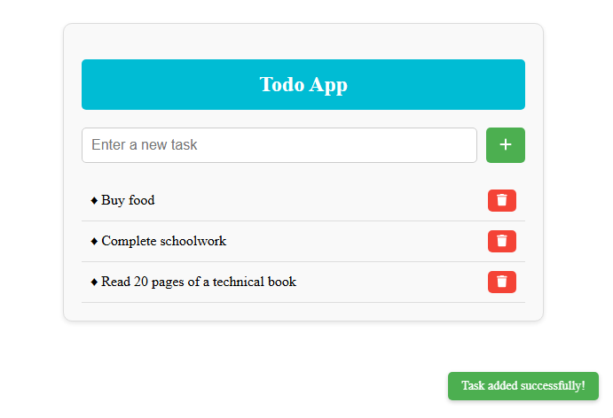

# Todo App

A simple, Todo application built with Angular, C#, and Microsoft Sql Server

## Screenshot

## Features

### 1. **Task Management**
- Add, delete, and view tasks using a user-friendly interface.
- Data persistence is handled by a REST API that connects to an MSSQL database.

### 2. **Toast Notifications**
- Informative toast notifications provide immediate feedback to the user.
- Toasts stack dynamically and fade out automatically after a short duration.
- Notifications are color-coded for success (green) and error (red) messages.

### 3. **Responsive Design**
- Clean and modern UI designed with CSS.
- The app is responsive and works seamlessly across different screen sizes.

### 4. **Font Awesome Integration**
- Icons enhance the app's usability and design.
- Used for buttons such as adding and deleting tasks (`faPlus` and `faTrash`).

### 5. **Angular Framework**
- Built with Angular standalone components for better modularity and performance.
- Uses Angular's powerful data-binding and dependency injection features.

---

## Technology Stack

### **Frontend**
- **Angular**: For building a dynamic and responsive UI.
- **Font Awesome**: For elegant and functional icons.
- **CSS**: For responsive and clean styling.

### **Backend**
- **REST API**: Serves as the intermediary between the frontend and the database.
- **MSSQL Database**: Stores tasks persistently.

### **Additional Libraries**
- **@fortawesome/angular-fontawesome**: For seamless integration of Font Awesome icons into the Angular project.
- **HttpClientModule**: For making HTTP requests to the backend API.
- **FormsModule**: For two-way data binding in form inputs.

---

## Installation

### Prerequisites
- Node.js installed on your system.
- Angular CLI installed globally.
- An MSSQL database set up with a `tasks` table to store task data.
- A backend API running on `http://localhost:8000/`.

Usage
Add a Task
Enter a task description in the input box.
Click the Add button (with the + icon).
The task will be added to the database and displayed in the task list.
Delete a Task
Click the Delete button (with the trash icon) next to the task.
The task will be removed from the database and the UI.
Toast Notifications
Success and error messages appear at the bottom-right of the screen.
Notifications stack and fade away automatically after 3.5 seconds.
Code Overview
app.component.ts
Handles the core logic of the app, including:

Fetching tasks from the database (get_tasks()).
Adding new tasks (add_task()).
Deleting tasks (delete_task()).
Managing toast notifications via the ToastComponent.
app.component.html
Defines the structure of the application, including:

Input field and button for adding tasks.
Task list section with delete functionality.
Integration of the ToastComponent.
app.component.css
Styles the UI with a focus on:

A clean and modern design.
Responsive layout for all screen sizes.
toast.component.ts
Handles the toast notifications, including:

Displaying success and error messages.
Stacking multiple notifications.
Automatically fading and removing toasts after a delay.
toast.component.css
Styles for the toast notifications, including:

Dynamic positioning at the bottom-right of the screen.
Smooth fade-out animations.
